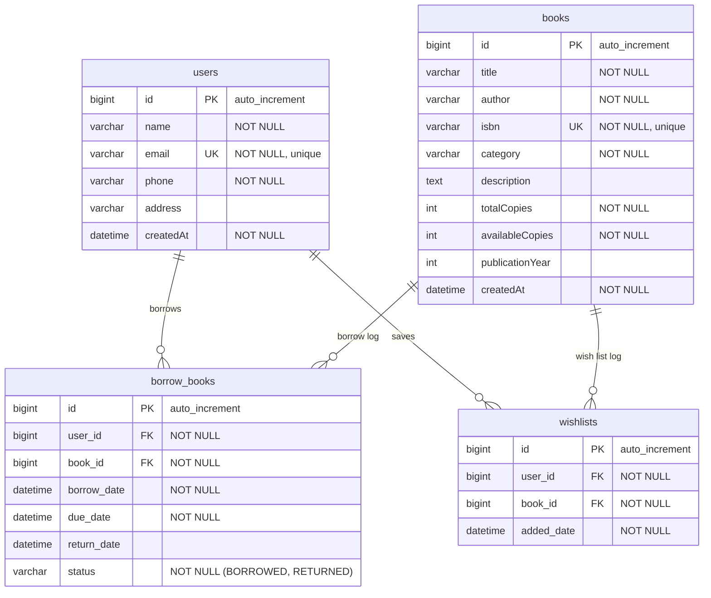

# Database Schema Explanation: Library Management System

This document outlines the database schema design for the Library Management System, illustrating tables, columns, constraints, and relationships.

---

## 1. Entity Relationship Diagram (ERD)

---

## 2. Table Specifications

### 2.1 Table: `books`
Stores details about books in the library catalog.

| Column Name | SQL Type | JPA/Constraint Configuration | Description |
| :--- | :--- | :--- | :--- |
| `id` | `BIGINT` | Primary Key, Auto Increment | Unique identifier for a book. |
| `title` | `VARCHAR(255)` | `NOT NULL` | The title of the book. |
| `author` | `VARCHAR(255)` | `NOT NULL` | The author of the book. |
| `isbn` | `VARCHAR(255)` | `NOT NULL`, `UNIQUE` | International Standard Book Number. |
| `category` | `VARCHAR(255)` | `NOT NULL` | Category/Genre of the book. |
| `description` | `TEXT` | Nullable | Brief summary of the book. |
| `total_copies` | `INT` | `NOT NULL`, `DEFAULT 0` | Total copies owned by the library. |
| `available_copies` | `INT` | `NOT NULL`, `DEFAULT 0` | Copies available to be borrowed. |
| `publication_year`| `INT` | Nullable | The year of publication. |
| `created_at` | `DATETIME(6)` | `NOT NULL`, Updatable = False | Audit timestamp for book creation. |

---

### 2.2 Table: `users`
Stores details of registered library patrons.

| Column Name | SQL Type | JPA/Constraint Configuration | Description |
| :--- | :--- | :--- | :--- |
| `id` | `BIGINT` | Primary Key, Auto Increment | Unique identifier for a user. |
| `name` | `VARCHAR(255)` | `NOT NULL` | Full name of the user. |
| `email` | `VARCHAR(255)` | `NOT NULL`, `UNIQUE` | Email address of the user (used as unique login/id). |
| `phone` | `VARCHAR(255)` | `NOT NULL` | Contact number. |
| `address` | `VARCHAR(255)` | Nullable | Residential address. |
| `created_at` | `DATETIME(6)` | `NOT NULL`, Updatable = False | Audit timestamp for user registration. |

---

### 2.3 Table: `borrow_books`
A junction transaction log record representing books borrowed by users. It implements a **Many-to-One** relationship to both `users` and `books`.

| Column Name | SQL Type | JPA/Constraint Configuration | Description |
| :--- | :--- | :--- | :--- |
| `id` | `BIGINT` | Primary Key, Auto Increment | Unique borrow log transaction ID. |
| `user_id` | `BIGINT` | Foreign Key (`users.id`), `NOT NULL` | Links to the user borrowing the book. |
| `book_id` | `BIGINT` | Foreign Key (`books.id`), `NOT NULL` | Links to the borrowed book. |
| `borrow_date` | `DATETIME(6)` | `NOT NULL` | Date and time the book was borrowed. |
| `due_date` | `DATETIME(6)` | `NOT NULL` | Date by which the book must be returned. |
| `return_date` | `DATETIME(6)` | Nullable | Date and time the book was actually returned. |
| `status` | `VARCHAR(255)` | `NOT NULL` | Status enum mapping. Values: `BORROWED`, `RETURNED`. |

---

### 2.4 Table: `wishlists`
A wishlist record representing books saved by users to read later. Implements a **Many-to-One** relationship to both `users` and `books`. Also maintains a unique constraint on `(user_id, book_id)` to prevent adding duplicate books to the wishlist.

| Column Name | SQL Type | JPA/Constraint Configuration | Description |
| :--- | :--- | :--- | :--- |
| `id` | `BIGINT` | Primary Key, Auto Increment | Unique wishlist log entry ID. |
| `user_id` | `BIGINT` | Foreign Key (`users.id`), `NOT NULL` | Links to the user saving the book. |
| `book_id` | `BIGINT` | Foreign Key (`books.id`), `NOT NULL` | Links to the saved book. |
| `added_date` | `DATETIME(6)` | `NOT NULL` | Date and time the book was saved to the wishlist. |

---

## 3. Relationships Mapping

1. **User to Borrow Records**: One user can borrow many books over time. This is represented by a `One-to-Many` mapping in spirit, though implemented via a `Many-to-One` association in `BorrowBook` pointing back to `User`.
2. **Book to Borrow Records**: One book can have many borrow log entries. Represented via `Many-to-One` association in `BorrowBook` pointing back to `Book`.
3. **User to Wishlist**: One user can maintain multiple wishlist entries. Represented via `Many-to-One` association in `WishList` pointing back to `User`.
4. **Book to Wishlist**: Many users can add the same book to their wishlists. Represented via `Many-to-One` association in `WishList` pointing back to `Book`.
